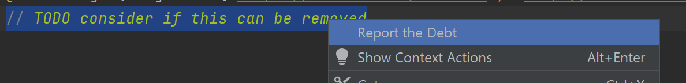
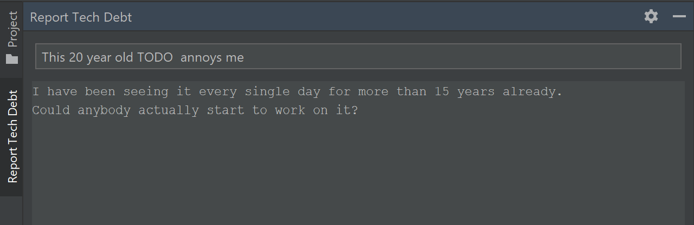
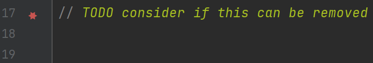
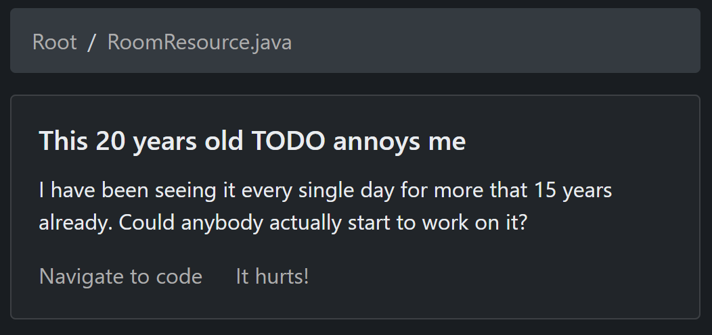
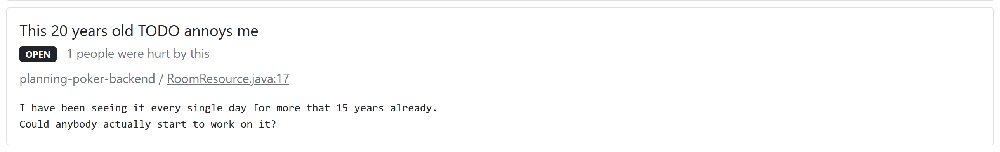

# Getting started with It Hurts
**It Hurts** is a technical debt manager. It lives right in your IDE so you can share your concerns about the code with your teammates without leaving it. It adds great visibility of existing problems when you are working with the code.

Also, It Hurts integrates with your code repositories, keeping track of repositories events and automatically updates the debt records, trying to keep everything up-to-date.

This article describes how to start to work with It Hurts in a few steps.

## Connect It Hurts to your codebase
Sign in to It Hurts with one of supported  source code hosting services (currently, only Bitbucket is supported), then click "Create workspace" on the dashboard right-top menu. You will be redirected to  Bitbucket where you will see It Hurts for Bitbucket app authorization dialog. Choose workspace/organization you want It Hurts connected to. As soon as you grant It Hurts access to your repositories, your It Hurts workspace is created.

> **Note:** Unfortunately, for now, It Hurts for Bitbucket is not listed in Atlassian Marketplace, that's why you will need to enable development mode for your Bitbucket Cloud workspace to connect It Hurts to it. (If it is the case for you, Bitbucket will show you corresponding warning)

## Working with It Hurts from IDE
To start working with It Hurts you need to install a plugin for your IDE.

### Intellij IDEA (and other Intellij Platform IDEs)
#### Plugin installation
You can install/download the plugin from JetBrains Marketplace: <a href="https://plugins.jetbrains.com/plugin/18380-it-hurts-integration/versions/stable/153337" target="_blank">click here!</a>
- After you have installed the plugin, go to Settings -> Tools -> ItHurts. 
- Click Connect to It Hurts. You will be redirected to It Hurts, where if you are logged in, you will find an authorization code.
- Put the authorization code into "Code" field in the settings dialog and click "Ok".
- If everything is fine, you will see "Logged as ..." label in the settings dialog.

#### Reporting technical debt
While working with the code, select the code you do not like (if the code hurts you, it is exactly the place you want to report to It Hurts). Right-click on the selected code and choose "Report Tech Debt" in the context menu.

"Report Technical Debt" tool windows will be opened. Specify the title (what's wrong with the code) and some description (why exactly the code is base? what is the correct way?). 

Click "It Hurts!" button in the lower right corner of the tool window. That's it, you have just posted the first technical debt report and it's shared with your team.

You can see that the line you reported on is marked now:

Call **Show File Technical Debts** action (_Alt+Shift+H_ / Or use Intellij IDEA's Actions Search dialog), Technical Debt Reports browser should appear and show report you've just posted:

Navigate to <a href="https://ithurts.dev/dashboard">dashboard</a>, the debt is also visible there:

